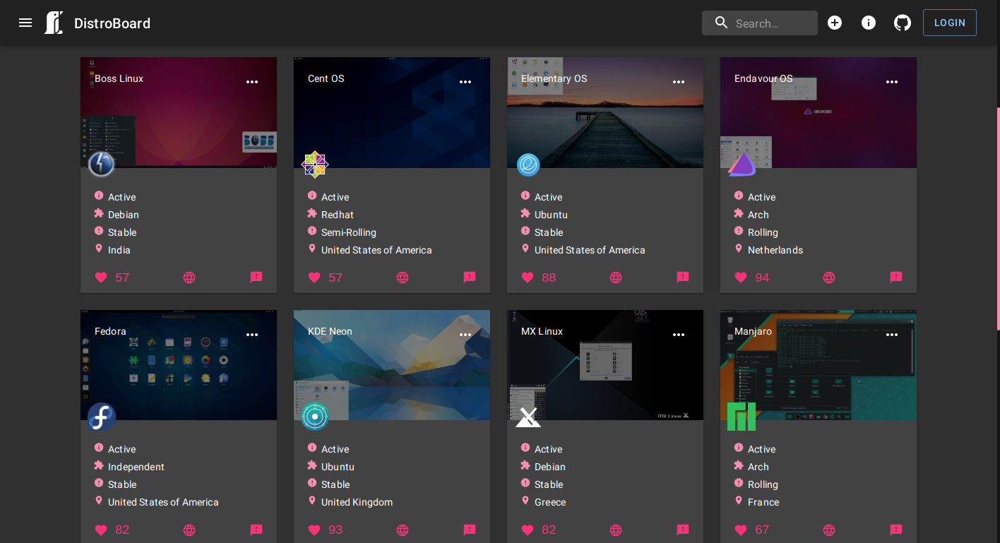

# DistroBoard
A modern and opensource alternative to distrowatch





# Notes for developers

## Instructions to run application in develpment

* Install all frontend dependencies 

```html
cd DistroBoard/DistroBoard/client
yarn install
```

* Install all backend dependencies 

```html
cd DistroBoard/DistroBoard/server
yarn install
```


* Start the application

> Backend

```html
cd DistroBoard/server
yarn dev
```

> Frontend

```html
cd DistroBoard/client
yarn start
```

## Directory Structure

> Backend

```
server/
├── config (consists of the database configuration)
|   |
│   └── db.js 
├── routes (contains declarations for all the routes used by the backend)
|   |
│   └── distros.js
├── controllers (the functionality of all routes are defined here)
|   |
│   └── distros.js
├── index.js (the startpoint of the backend application)
├── models (contains the mongodb schema used by the frontend)
|   |
│   └── distroInfo.js
├── package.json ( a detailed list of all packages used in the backend)
└── yarn.lock (lock file for packages)
```

<br>

> Frontend

```
client/
├── public (the public directory of the frontend, contains basic metadata for the application)
|   |
│   ├── favicon.ico
│   ├── index.html
│   ├── logo192.png
│   ├── logo512.png
│   ├── logo.png
│   ├── manifest.json
│   └── robots.txt
├── README.md (contains documentation on how to use react with yarn package manager)
|   |
├── src (contains the souce code for the frontend)
|   |
│   ├── actions (contains all the actions used by redux)
│   │   └── distros.js
│   └── reducers ( all reducers used by redux are defined here)
│       ├── distros.js
│       └── index.js
│   ├── constants (the constants defined for redux)
│   │   └── actions.js
│   ├── api (all api calls from the backend are declared here)
│   │   └── index.js
|   |
│   ├── App.js (the main component for the application, parent to all other components)
|   |
│   ├── assets (contains all assets used by the application)
│   │   └── images
│   │       ├── attribute.txt
│   │       └── logo.png
|   |
│   ├── components ( contains all reuseable react components)
|   |
│   │   ├── Distros (displays all distros in a grid)
|   |   |   |   
│   │   │   ├── Distro ( a singular distro card) 
│   │   │   │   ├── Distro.js
│   │   │   │   └── styles.js
│   │   │   ├── Distros.js
│   │   │   └── styles.js
│   │   ├── Form (the form used by admins to manage distro information)
│   │   │   ├── Form.js
│   │   │   └── styles.js
│   │   ├── Header (the header bar containing the search bar and other links)
│   │   │   ├── Header.js
│   │   │   └── styles.js
│   │   └── Search ( the search bar used to search distros)
│   │   |    ├── Search.js
│   │   |    └── styles.js
│   │   └── AllDistros (displays all distros in alphabetical order used by react-router)
│   │   |    ├── AllDistros.js 
│   │   └── About (about page used by react-router)
│   │   |    ├── About.js
│   │   |    └── styles.js
│   │   └── Auth (auth page used by react-router)
│   │       ├── Auth.js
|   |
│   ├── index.js (the startpoint of the frontend)
├── package.json (a detailed list of all packages used in the backend)
└── yarn.lock (lock file for packages)

```

# Key Developers
| Contributor                                         | Role              |
|-----------------------------------------------------|-------------------|
| [VULKAN](https://github.com/CTZxVULKAN)             | FullStack Web Dev |
| [Abdellatif-dev](https://github.com/abdellatif-dev) | Server Guy        |
| [NarutoXY](https://github.com/NarutoXY)             | FrontEnd Web Dev  |

# Stack


